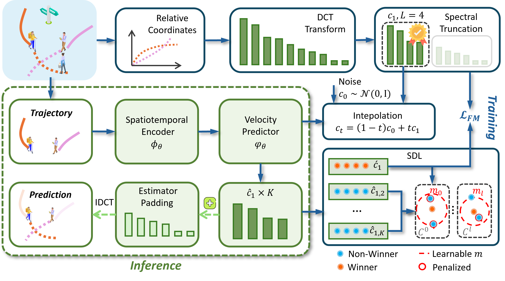

# LR-SFM

Official PyTorch implementation of **Low-rank Spectral Flow Matching for Human
Trajectory Prediction**, accepted by **KDD 2026**.

<p align="center">
  
</p>

## Overview

LR-SFM is a flow-matching framework for multi-modal human trajectory prediction. Instead of generating future coordinates directly, LR-SFM performs generation in a truncated DCT space, where most trajectory energy is concentrated in the first few spectral modes.

The released configs use an MTR-style multi-query decoder and Spectral Diversity Loss. Evaluation defaults to `K=20` samples and `3` Euler steps.

## Installation

LR-SFM requires Python >= 3.10 and PyTorch >= 2.0. We recommend installing PyTorch from the [official selector](https://pytorch.org/get-started/locally/) to match your CUDA version.

```bash
conda create -n lrsfm python=3.11
conda activate lrsfm
pip install -r requirements.txt
```

## Data

This repository does not include datasets or pretrained checkpoints.

ETH-UCY and SDD use the trajectory split format released by [V2-Net](https://github.com/cocoon2wong/Vertical):

```text
data/trajectory_standard/
  datasets/*.plist
  datasets/subsets/*.plist
  data/*/true_pos_.csv
```

NBA follows the processed `.npy` format used by [MoFlow](https://github.com/DSL-Lab/MoFlow):

```text
data/pedestrian/nba/
  nba_train.npy
  nba_test.npy
```

You can also pass `--data-root /path/to/root` to the training and evaluation scripts.

## Training

```bash
python scripts/train.py --config config/ethucy_eth.yaml
python scripts/train.py --config config/sdd.yaml
python scripts/train.py --config config/nba.yaml
```

For ETH-UCY, replace `ethucy_eth.yaml` with `ethucy_hotel.yaml`,
`ethucy_univ.yaml`, `ethucy_zara1.yaml`, or `ethucy_zara2.yaml`.

Checkpoints are saved under `ckpt/` by default.

## Evaluation

```bash
python scripts/evaluate.py --config config/ethucy_eth.yaml --ckpt ckpt/ethucy/eth.pt
python scripts/evaluate.py --config config/sdd.yaml --ckpt ckpt/sdd.pt
python scripts/evaluate.py --config config/nba.yaml --ckpt ckpt/nba.pt
```

Use `--kde-nll` to additionally report KDE-NLL. Common options can be overridden with `--set key=value`, for example:

```bash
python scripts/evaluate.py --config config/ethucy_zara1.yaml --ckpt ckpt/ethucy/zara1.pt --set padding=linear
```

## Structure

- `lr_sfm/`: model, data loading, DCT utilities, training, and evaluation code.
- `scripts/`: command-line entry points for training and evaluation.
- `config/`: dataset-specific YAML configs.
- `data/trajectory_standard/README.md`: expected ETH-UCY and SDD data layout.
- `images/`: figures used in this README.

## Citation

If you find this work useful, please cite:

```bibtex
@inproceedings{mao2026lrsfm,
  title     = {Low-Rank Spectral Flow Matching for Human Trajectory Prediction},
  author    = {Mao, Chaojin and Hu, Jia and Min, Geyong},
  booktitle = {Proceedings of the 32nd ACM SIGKDD Conference on Knowledge Discovery and Data Mining V.2 (KDD '26)},
  year      = {2026},
  doi       = {10.1145/3770855.3818207}
}
```


## Acknowledgements

We thank the authors of V2-Net and MoFlow for releasing their data processing
and split files.

## Contact

For questions or bug reports please open a GitHub issue.
